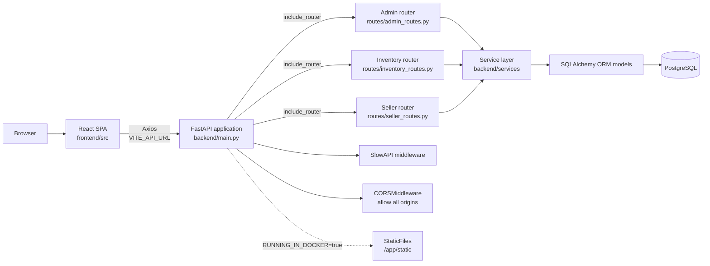
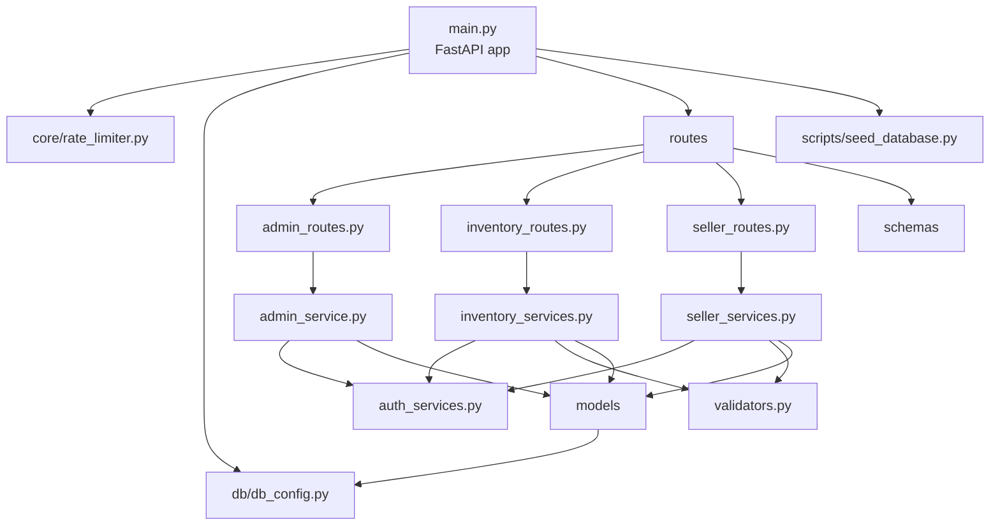
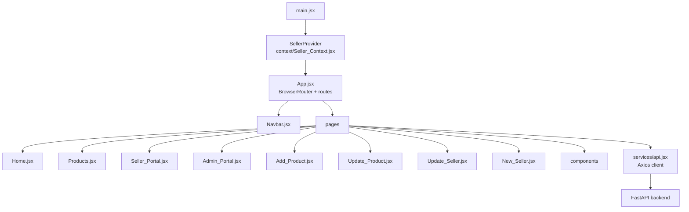
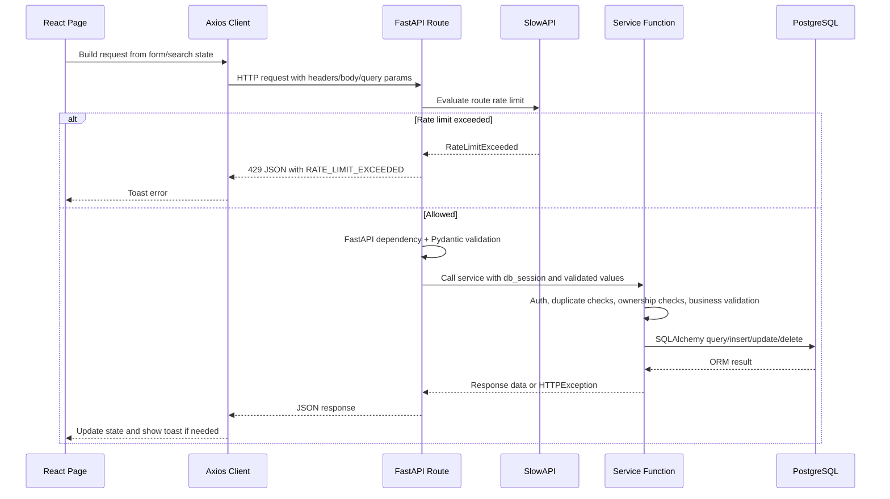
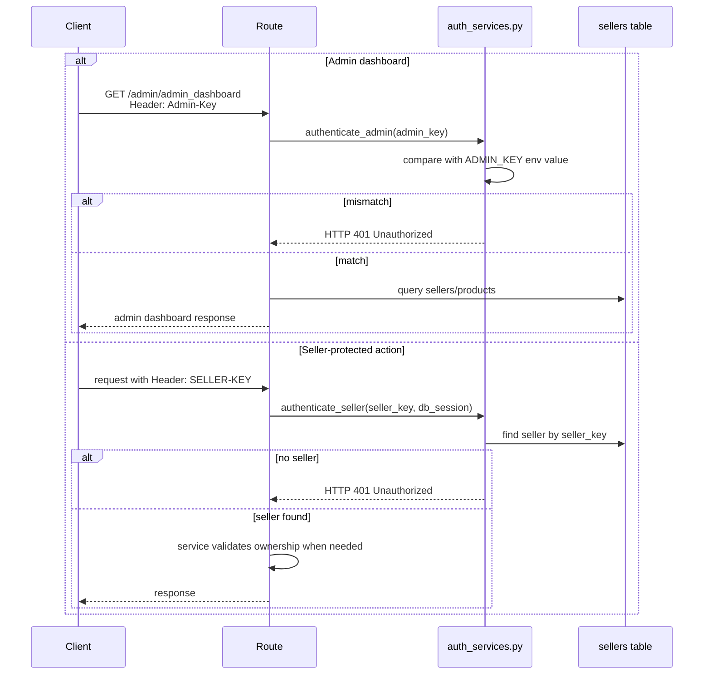

# Architecture

This document describes the architecture implemented in the repository as it exists today. It does not describe planned services, queues, caches, migrations, background workers, or authentication systems that are not present in the code.

## System Context

The application is a two-part system:

| Part | Entry point | Responsibility |
| --- | --- | --- |
| Backend | `backend/main.py` | FastAPI app, router registration, database table creation, CSV seeding, CORS, rate limiting, Docker static frontend mount |
| Frontend | `frontend/src/main.jsx` and `frontend/src/App.jsx` | React app bootstrap, routing, seller-key context provider, pages, forms, tables, API calls |

## Backend Component Architecture

### Backend Layers

| Layer | Files | What it does |
| --- | --- | --- |
| Application bootstrap | `backend/main.py` | Creates `FastAPI()`, installs SlowAPI middleware, adds CORS, creates tables, seeds data, registers routers, optionally mounts built frontend |
| Configuration | `backend/config.py`, `backend/db/db_config.py` | Loads `.env`, reads `ADMIN_KEY` and `DATABASE_URL`, creates SQLAlchemy engine/session/Base |
| Routers | `backend/routes/*.py` | Defines paths, HTTP methods, response models, headers, query params, rate limits, and dependencies |
| Services | `backend/services/*.py` | Contains business logic, authentication checks, validation, ownership checks, SQLAlchemy queries/mutations |
| Schemas | `backend/schemas/*.py` | Defines Pydantic request and response models |
| Models | `backend/models/*.py` | Defines SQLAlchemy table mappings for `sellers` and `inventory` |
| Scripts | `backend/scripts/*.py` | Imports seed data from CSV files when tables are empty |
| Core | `backend/core/rate_limiter.py` | Creates the SlowAPI limiter and custom `429` response |

## Frontend Component Architecture

### Frontend Layers

| Layer | Files | What it does |
| --- | --- | --- |
| Bootstrap | `frontend/src/main.jsx` | Renders React in `StrictMode` and wraps the app in `SellerProvider` |
| Routing | `frontend/src/App.jsx` | Defines SPA routes and renders `Navbar`, page content, and `Toaster` |
| API client | `frontend/src/services/api.jsx` | Creates Axios instance from `VITE_API_URL`, sets timeout, handles `429`, exposes error helpers |
| Shared state | `frontend/src/context/*` | Stores `sellerKey` and `setSellerKey` in React Context |
| Pages | `frontend/src/pages/*.jsx` | Implements user workflows |
| Components | `frontend/src/components/*.jsx` | Reusable forms, tables, cards, navbar, search input, and page states |
| Styling | `frontend/src/index.css` | Global responsive UI styles |

`frontend/src/App.css` exists but is not imported by the current React entry path.

## Request Lifecycle

## Authentication Flow

## Data Flow

### Startup and Seeding

1. `backend/db/db_config.py` loads `.env`, reads `DATABASE_URL`, and creates the SQLAlchemy engine/session factory.
2. `backend/main.py` imports `Base` and `engine`.
3. `Base.metadata.create_all(bind=engine)` creates missing tables for the registered SQLAlchemy models.
4. `seed_database()` opens a session and checks table counts.
5. If `sellers` is empty, `csvdata_seller_import.py` imports `backend/sample_data/_seller_data.csv`.
6. If `inventory` is empty, `csvdata_inventory_import.py` imports `backend/sample_data/_inventory_data.csv`.

### Public Product Listing

1. React `Products.jsx` calls `GET /inventory/show-all-products`.
2. `inventory_routes.show_all_items()` calls `all_products()`.
3. `all_products()` joins `inventory` and `sellers`, orders by `item_id`, and returns product dictionaries.
4. The route response model is `list[Inventory_Response_Schema]`, so seller fields returned by the service are filtered out of the HTTP response.

### Product Search

1. React `Products.jsx` calls `GET /inventory/search-products` with `ITEM_NAME` for frontend search.
2. The route also accepts `ITEM_ID`, `ITEM_CATEGORY`, `ITEM_PRICE`, `IN_STOCK`, `SELLER_ID`, and `SELLER_NAME`.
3. `search_products()` applies exact-match SQLAlchemy filters for each provided value.
4. If no item matches, it raises `404` with `detail="Item not found"`.

### Seller Product Mutation

1. React sends `SELLER-KEY` with product create/update/delete.
2. `authenticate_seller()` finds the seller by `seller_key`.
3. Update/delete flows load the target product by `item_id`.
4. `validate_item_ownership()` prevents a seller from modifying another seller's product.
5. `validate_price()` and `validate_stock()` enforce price/stock rules.
6. SQLAlchemy commits the mutation.

### Seller Account Mutation

1. React sends `SELLER-KEY` with seller update/delete.
2. `authenticate_seller()` finds the seller.
3. `validate_seller_account_ownership()` ensures the authenticated seller matches the target seller ID.
4. Updates check duplicate email/key before commit.
5. Deletes are blocked if the seller still owns inventory items.

## Error Handling

| Source | Behavior |
| --- | --- |
| FastAPI/Pydantic | Invalid request shapes return validation errors, typically `422` |
| Auth services | Invalid admin or seller key raises `HTTPException(401, detail="Unauthorized")` |
| Ownership validators | Cross-seller modification attempts raise `403` |
| Business validators | Invalid price/stock or duplicate seller data raises `400` |
| Not found checks | Missing items/sellers or empty admin dashboard can raise `404` |
| SlowAPI | Rate limit violations return `429` with `success`, `error`, and `message` |
| Frontend API client | Formats API error details and shows a toast for `429` responses |

There is no custom global exception middleware beyond the SlowAPI rate-limit handler.

## Logging and Observability

The current code uses `print()` statements in:

- `backend/db/db_config.py` to print `DATABASE_URL`
- CSV import scripts to print field names, duplicates, and import success

No structured logging, request ID middleware, metrics, tracing, or health-check endpoint is currently implemented. This is **Work in Progress / Planned** for production hardening.

## Design Patterns Present

| Pattern | Evidence |
| --- | --- |
| Layered API architecture | Routes delegate business logic to services, services use models/schemas/validators |
| Dependency injection | FastAPI `Depends(get_db)` provides per-request SQLAlchemy sessions |
| Schema validation | Pydantic models validate request bodies and selected response payloads |
| Header-based authentication | `Admin-Key` and `SELLER-KEY` headers protect privileged flows |
| Service-level authorization | Ownership checks live in validators/services rather than React UI |
| React component composition | Pages reuse form, table, search, navbar, and page-state components |
| Shared client utilities | Axios instance and error helpers are centralized in `frontend/src/services/api.jsx` |

## Not Implemented

These are not present in the repository and should not be described as current features:

- Alembic migrations
- Unit/integration/e2e tests
- JWT, OAuth, password hashing, sessions, refresh tokens, or RBAC
- Background jobs, queues, cache layers, or WebSockets
- Docker Compose
- CI/CD pipeline
- Structured logging or metrics
- API versioning
- File uploads or product images stored through the API
