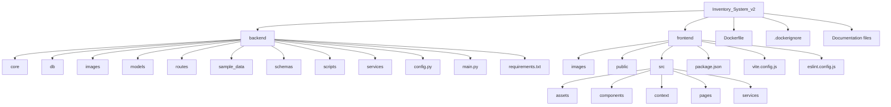

# Project Structure

This document maps the repository layout and the responsibility of each major file/folder.

## Folder Hierarchy



## Root

| Path | Responsibility |
| --- | --- |
| `README.md` | Main project overview and setup guide |
| `ARCHITECTURE.md` | System architecture and request lifecycle |
| `API.md` | Endpoint reference |
| `DATABASE.md` | Database schema and seed behavior |
| `SECURITY.md` | Current controls and hardening plan |
| `DEPLOYMENT.md` | Local and Docker deployment |
| `CONTRIBUTING.md` | Contribution workflow |
| `PROJECT_STRUCTURE.md` | This file |
| `TECH_STACK.md` | Dependency and technology inventory |
| `INTERVIEW_GUIDE.md` | Portfolio/interview preparation |
| `Dockerfile` | Multi-stage frontend/backend Docker image |
| `.dockerignore` | Excludes local envs, caches, `.git`, virtualenv, and `node_modules` from Docker build context |

## Backend

```text
backend/
|-- .env.example
|-- .gitignore
|-- config.py
|-- main.py
|-- requirements.txt
|-- core/
|   `-- rate_limiter.py
|-- db/
|   `-- db_config.py
|-- images/
|-- models/
|   |-- db_inventory.py
|   `-- db_seller.py
|-- routes/
|   |-- admin_routes.py
|   |-- inventory_routes.py
|   `-- seller_routes.py
|-- sample_data/
|   |-- _inventory_data.csv
|   `-- _seller_data.csv
|-- schemas/
|   |-- admin_schema.py
|   |-- inventory_schema.py
|   `-- seller_schema.py
|-- scripts/
|   |-- csvdata_inventory_import.py
|   |-- csvdata_seller_import.py
|   `-- seed_database.py
`-- services/
    |-- admin_service.py
    |-- auth_services.py
    |-- inventory_services.py
    |-- seller_services.py
    `-- validators.py
```

### Backend File Responsibilities

| Path | Responsibility |
| --- | --- |
| `backend/main.py` | FastAPI entry point, middleware, table creation, seeding, router registration, Docker static mount |
| `backend/config.py` | Loads `.env` and exposes `ADMIN_KEY` |
| `backend/requirements.txt` | Python dependency pins |
| `backend/core/rate_limiter.py` | SlowAPI limiter and custom `429` response |
| `backend/db/db_config.py` | Loads `DATABASE_URL`, creates SQLAlchemy engine/session/Base, provides `get_db()` |
| `backend/models/db_seller.py` | `sellers` table mapping |
| `backend/models/db_inventory.py` | `inventory` table mapping |
| `backend/routes/admin_routes.py` | `/admin/admin_dashboard` route |
| `backend/routes/inventory_routes.py` | Inventory list/search/create/update/delete routes |
| `backend/routes/seller_routes.py` | Seller signup/dashboard/update/delete routes |
| `backend/schemas/admin_schema.py` | Admin dashboard response models |
| `backend/schemas/inventory_schema.py` | Inventory request/response models |
| `backend/schemas/seller_schema.py` | Seller request/response models |
| `backend/services/admin_service.py` | Admin dashboard service logic |
| `backend/services/auth_services.py` | Admin and seller authentication helpers |
| `backend/services/inventory_services.py` | Inventory service logic |
| `backend/services/seller_services.py` | Seller service logic |
| `backend/services/validators.py` | Price, stock, ownership, duplicate email/key validators |
| `backend/scripts/seed_database.py` | Startup seed orchestrator |
| `backend/scripts/csvdata_seller_import.py` | Seller CSV import |
| `backend/scripts/csvdata_inventory_import.py` | Inventory CSV import |
| `backend/sample_data/*.csv` | Demo seed data |
| `backend/images/*.png` | Backend/database documentation screenshots |

## Frontend

```text
frontend/
|-- .env
|-- .env.production
|-- .gitignore
|-- README.md
|-- eslint.config.js
|-- index.html
|-- package-lock.json
|-- package.json
|-- vite.config.js
|-- images/
|-- public/
|   |-- favicon.svg
|   `-- icons.svg
`-- src/
    |-- App.css
    |-- App.jsx
    |-- index.css
    |-- main.jsx
    |-- assets/
    |   |-- hero.png
    |   |-- react.svg
    |   `-- vite.svg
    |-- components/
    |   |-- Navbar.jsx
    |   |-- PageState.jsx
    |   |-- ProductForm.jsx
    |   |-- Product_Card.jsx
    |   |-- Product_Table.jsx
    |   |-- SearchInput.jsx
    |   |-- SellerForm.jsx
    |   `-- Seller_Card.jsx
    |-- context/
    |   |-- Seller_Context.jsx
    |   `-- sellerContext.js
    |-- pages/
    |   |-- Add_Product.jsx
    |   |-- Admin_Portal.jsx
    |   |-- Home.jsx
    |   |-- New_Seller.jsx
    |   |-- Products.jsx
    |   |-- Seller_Portal.jsx
    |   |-- Update_Product.jsx
    |   `-- Update_Seller.jsx
    `-- services/
        `-- api.jsx
```

### Frontend File Responsibilities

| Path | Responsibility |
| --- | --- |
| `frontend/package.json` | npm scripts and dependency declarations |
| `frontend/vite.config.js` | Vite React plugin configuration |
| `frontend/eslint.config.js` | ESLint flat config |
| `frontend/index.html` | Vite HTML entry |
| `frontend/src/main.jsx` | React bootstrap and seller context provider |
| `frontend/src/App.jsx` | BrowserRouter routes, navbar, toast provider |
| `frontend/src/index.css` | Active global styles |
| `frontend/src/App.css` | Present but not imported by current app entry |
| `frontend/src/services/api.jsx` | Axios client, timeout, `429` handling, error helpers |
| `frontend/src/context/*` | Seller-key React context |
| `frontend/src/pages/*.jsx` | Route-level user workflows |
| `frontend/src/components/*.jsx` | Shared UI components |
| `frontend/images/*.png` | Frontend screenshot assets |
| `frontend/public/*.svg` | Public favicon/icon assets |
| `frontend/src/assets/*` | Static Vite/React/hero assets |

## Generated / Local-Only Folders

These folders are present or expected locally but should not be treated as source:

| Path | Reason |
| --- | --- |
| `backend/v_env/` | Python virtual environment |
| `frontend/node_modules/` | npm dependencies |
| `__pycache__/` | Python bytecode cache |
| `.mypy_cache/` | mypy cache |
| `.ruff_cache/` | Ruff cache |
| `frontend/dist/` | Vite production build output |

## Environment Files

| Path | Notes |
| --- | --- |
| `backend/.env.example` | Documents `DATABASE_URL` and `ADMIN_KEY` |
| `backend/.env` | Local backend environment; should not contain public secrets |
| `backend/.env.docker` | Docker runtime environment; includes `RUNNING_IN_DOCKER=true` when serving frontend from FastAPI |
| `frontend/.env` | Local `VITE_API_URL` |
| `frontend/.env.production` | Production `VITE_API_URL` for frontend builds |

Do not commit reusable production secrets in environment files.

## Dependency Manifests

| Path | Ecosystem |
| --- | --- |
| `backend/requirements.txt` | Python |
| `frontend/package.json` | Node/npm direct dependencies and scripts |
| `frontend/package-lock.json` | npm lockfile |

## Current Absences

The repository currently has no:

- `tests/` directory
- Alembic migration directory
- Docker Compose file
- CI/CD workflow directory
- Backend package metadata such as `pyproject.toml`
- Frontend TypeScript configuration
