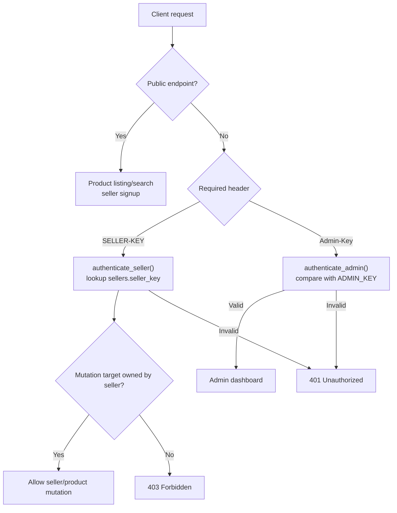

# Security Documentation

This document separates current security behavior from production hardening work. The repository implements basic key-based protection, ownership checks, validation, and rate limiting, but it does not implement a production authentication system.

## Current Security Model



## Implemented Controls

| Control | Implementation |
| --- | --- |
| Admin key check | `authenticate_admin()` compares `Admin-Key` header with `ADMIN_KEY` from environment |
| Seller key check | `authenticate_seller()` finds a row where `sellers.seller_key` matches `SELLER-KEY` |
| Seller ownership | `validate_seller_account_ownership()` blocks cross-seller account updates/deletes |
| Product ownership | `validate_item_ownership()` blocks cross-seller product updates/deletes |
| Email validation | Pydantic `EmailStr` |
| Seller-key format | Pydantic `Field(min_length=4, max_length=8, pattern=r"^[A-Za-z0-9]+$")` |
| Duplicate seller email/key | Service checks before create/update |
| Price validation | `validate_price()` rejects `price <= 0` |
| Stock validation | `validate_stock()` rejects `stock < 0` |
| Rate limiting | SlowAPI `Limiter(key_func=get_remote_address)` with per-route limits |
| SQL injection mitigation | SQLAlchemy ORM queries instead of raw SQL |
| Frontend error handling | Axios interceptor handles `429`; helpers format API errors |

## Authentication Details

### Admin Authentication

Admin dashboard access requires:

```http
Admin-Key: <ADMIN_KEY>
```

`ADMIN_KEY` is read from the environment in `backend/config.py`.

Failure behavior:

```json
{"detail": "Unauthorized"}
```

with HTTP `401`.

### Seller Authentication

Seller-protected endpoints require:

```http
SELLER-KEY: <seller key>
```

The key is matched against `sellers.seller_key`.

Failure behavior:

```json
{"detail": "Unauthorized"}
```

with HTTP `401`.

## Authorization Rules

| Action | Authorization rule |
| --- | --- |
| Add product | Any valid seller key can create a product under that seller ID |
| Update product | Seller key must belong to the product owner |
| Delete product | Seller key must belong to the product owner |
| Load seller dashboard | Seller key determines which seller profile/products are returned |
| Update seller | Seller key must belong to the target seller ID |
| Delete seller | Seller key must belong to the target seller ID, and seller must have no products |
| Load admin dashboard | `Admin-Key` must match `ADMIN_KEY` |

## Rate Limits

| Endpoint | Rate limit |
| --- | --- |
| `POST /seller/new-seller-signup` | `3/minute` |
| `GET /seller/seller-dashboard` | `5/minute` |
| `PUT /seller/update-seller` | `5/minute` |
| `DELETE /seller/delete-seller` | `5/minute` |
| `GET /admin/admin_dashboard` | `5/minute` |
| `GET /inventory/show-all-products` | `50/minute` |
| `GET /inventory/search-products` | `50/minute` |
| `POST /inventory/add-product` | `20/minute` |
| `PUT /inventory/update-product` | `20/minute` |
| `DELETE /inventory/delete-product` | `20/minute` |

Rate-limit response:

```json
{
  "success": false,
  "error": "RATE_LIMIT_EXCEEDED",
  "message": "Too many requests. Please try again after few minutes."
}
```

## Current Risks

| Risk | Status | Why it matters |
| --- | --- | --- |
| Plaintext seller keys | **Work in Progress / Planned** | Database exposure reveals credentials immediately |
| Static admin key | **Work in Progress / Planned** | No rotation, expiry, identity, or audit model |
| No password/JWT/session model | **Planned** | Cannot support standard login/logout, token expiry, or roles |
| Permissive CORS | **Needs hardening** | `allow_origins=["*"]` is suitable for development, not restricted production |
| Database URL printed at startup | **Needs hardening** | Credentials may leak into logs |
| No structured audit logging | **Planned** | Mutations are not traceable by request/user/time |
| No HTTPS/reverse proxy config | **Deployment responsibility** | Transport security is not configured in this repo |
| No secret manager integration | **Deployment responsibility** | `.env` files are used locally |
| No tests | **Planned** | Security regressions are harder to catch |
| No migrations | **Planned** | Schema changes are not versioned/reviewable |

## Sensitive Files

The repository contains environment-related files:

| File | Purpose |
| --- | --- |
| `backend/.env.example` | Template for backend variables |
| `backend/.env` | Local backend secrets; should not be committed to a public repository |
| `backend/.env.docker` | Docker runtime variables; should not contain reusable production secrets |
| `frontend/.env` | Local frontend `VITE_API_URL` |
| `frontend/.env.production` | Production frontend `VITE_API_URL` |

If this repository has ever been pushed publicly with real credentials, rotate those credentials.

## Recommended Production Hardening

### High Priority

- Remove or redact `print("DATABASE_URL =", DATABASE_URL)`.
- Restrict CORS origins to trusted frontend domains.
- Replace seller keys with hashed credentials or a real seller login flow.
- Replace static admin key with a real admin authentication model.
- Store secrets in deployment secrets/config, not committed `.env` files.
- Add tests for authentication, authorization, validation, and rate limits.
- Add migration tooling such as Alembic.

### Medium Priority

- Add structured logging with request IDs.
- Add audit records for seller/product create, update, and delete operations.
- Add a health endpoint that does not leak sensitive information.
- Add explicit security headers at the reverse proxy or middleware layer.
- Add account/key rotation flows.
- Add API versioning before public clients depend on the contract.

### Lower Priority / Future Enhancements

- Add role-based access control if multiple admin roles are introduced.
- Add soft delete/deactivation instead of hard deletes.
- Add monitoring, metrics, and alerting around `401`, `403`, `429`, and error rates.

## Security Testing Checklist

Before deploying beyond local/demo use, verify:

- Invalid `SELLER-KEY` returns `401`.
- A valid seller key cannot update/delete another seller's product.
- A valid seller key cannot update/delete another seller account.
- Seller deletion fails while inventory exists.
- Invalid `Admin-Key` returns `401`.
- Duplicate seller emails and seller keys are rejected.
- Price `0`, negative price, and negative stock are rejected.
- Rate limits return the documented `429` response.
- CORS only allows expected origins.
- Logs do not contain credentials or connection strings.
