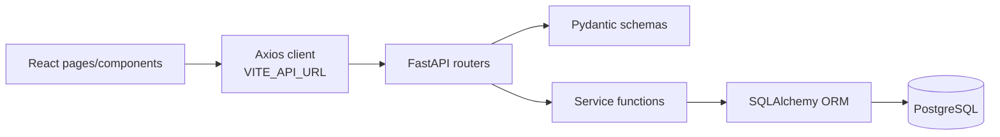

# Tech Stack

This document lists technologies actually present in the repository. It also identifies dependencies that are installed but not currently used by source files.

## Backend Runtime

| Technology | Version / Source | Used for |
| --- | --- | --- |
| Python | `python:3.12` in `Dockerfile`; Python 3.10+ syntax used locally | Backend runtime |
| FastAPI | `0.136.3` | API framework |
| Starlette | `1.1.0` | FastAPI underlying ASGI toolkit |
| Uvicorn | `0.48.0` | ASGI server |
| SQLAlchemy | `2.0.50` | ORM and database sessions |
| PostgreSQL | External database required by `DATABASE_URL` | Data persistence |
| psycopg2 | `2.9.12` | PostgreSQL driver |
| Pydantic | `2.13.4` | Request/response schemas |
| email-validator | `2.3.0` | `EmailStr` validation |
| python-dotenv | `1.2.2` | Loading `.env` files |
| SlowAPI | `0.1.10` | Rate limiting |
| limits | `5.8.0` | Rate-limit backend used by SlowAPI |

## Backend Dependency Inventory

Pinned in `backend/requirements.txt`:

| Package | Version |
| --- | --- |
| `annotated-doc` | `0.0.4` |
| `annotated-types` | `0.7.0` |
| `anyio` | `4.13.0` |
| `click` | `8.4.1` |
| `colorama` | `0.4.6` |
| `Deprecated` | `1.3.1` |
| `dnspython` | `2.8.0` |
| `email-validator` | `2.3.0` |
| `fastapi` | `0.136.3` |
| `greenlet` | `3.5.1` |
| `h11` | `0.16.0` |
| `idna` | `3.16` |
| `limits` | `5.8.0` |
| `packaging` | `26.2` |
| `pip-review` | `1.3.0` |
| `psycopg2` | `2.9.12` |
| `pydantic` | `2.13.4` |
| `pydantic_core` | `2.46.4` |
| `python-dotenv` | `1.2.2` |
| `slowapi` | `0.1.10` |
| `SQLAlchemy` | `2.0.50` |
| `starlette` | `1.1.0` |
| `typing-inspection` | `0.4.2` |
| `typing_extensions` | `4.15.0` |
| `uvicorn` | `0.48.0` |
| `wrapt` | `2.2.1` |

## Frontend Runtime

| Technology | Version | Used for |
| --- | --- | --- |
| React | `19.2.6` | UI components |
| React DOM | `19.2.6` | Browser rendering |
| Vite | `8.0.12` | Dev server/build tool |
| React Router DOM | `7.16.0` | SPA routing |
| Axios | `1.16.1` | API requests |
| React Hot Toast | `2.6.0` | Toast notifications |
| CSS | `frontend/src/index.css` | Global responsive styling |

## Frontend Dependency Inventory

Direct dependencies in `frontend/package.json`:

| Package | Version | Usage status |
| --- | --- | --- |
| `@reduxjs/toolkit` | `^2.12.0` | Installed, not currently imported/configured |
| `axios` | `^1.16.1` | Used in `frontend/src/services/api.jsx` |
| `bootstrap` | `^5.3.8` | Installed, not currently imported |
| `react` | `^19.2.6` | Used |
| `react-dom` | `^19.2.6` | Used |
| `react-hot-toast` | `^2.6.0` | Used in `App.jsx` and pages |
| `react-redux` | `^9.3.0` | Installed, not currently imported/configured |
| `react-router-dom` | `^7.16.0` | Used in `App.jsx` and pages |

Dev dependencies:

| Package | Version | Usage |
| --- | --- | --- |
| `@eslint/js` | `^10.0.1` | ESLint base config |
| `@types/react` | `^19.2.14` | React type definitions for tooling |
| `@types/react-dom` | `^19.2.3` | React DOM type definitions for tooling |
| `@vitejs/plugin-react` | `^6.0.1` | Vite React plugin |
| `eslint` | `^10.3.0` | Linting |
| `eslint-plugin-react-hooks` | `^7.1.1` | React hooks lint rules |
| `eslint-plugin-react-refresh` | `^0.5.2` | Vite React refresh linting |
| `globals` | `^17.6.0` | Browser globals in ESLint |
| `vite` | `^8.0.12` | Dev/build tool |

## API and Data Stack

## Styling and Assets

| Asset type | Location |
| --- | --- |
| Active app CSS | `frontend/src/index.css` |
| Legacy/unimported CSS | `frontend/src/App.css` |
| Frontend screenshots | `frontend/images/*.png` |
| Backend/database screenshots | `backend/images/*.png` |
| Public favicon/icons | `frontend/public/*.svg` |
| Vite/React/hero assets | `frontend/src/assets/*` |

## Build and Deployment Stack

| Tool | Used where |
| --- | --- |
| Docker | Root `Dockerfile` |
| Node 22 | Frontend build stage |
| Python 3.12 | Backend runtime stage |
| Uvicorn | Container command |
| StaticFiles | FastAPI serves `/app/static` when `RUNNING_IN_DOCKER=true` |

## Not Present

These technologies are not implemented in the current repository:

- TypeScript
- Alembic
- pytest or other test frameworks
- Docker Compose
- Redis, Celery, Kafka, or background workers
- JWT/OAuth/session authentication
- Redux store configuration
- Bootstrap imports/components
- CI/CD workflows
- Cloud provider deployment manifests
